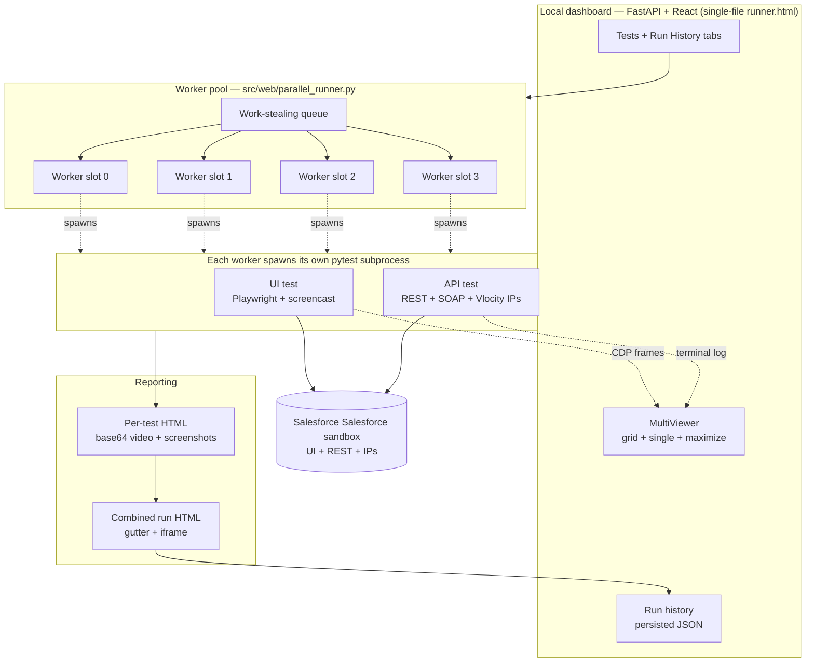
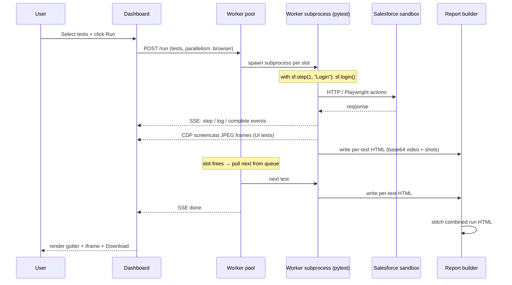
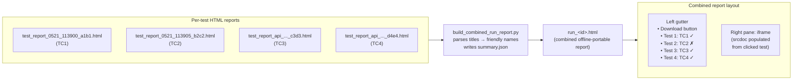

<div align="center">

# sfauto

**A production-grade test platform for Salesforce Revenue Cloud (Vlocity CPQ + Communications Cloud).**

UI tests in real browsers (Chrome / Edge / Firefox / Safari-WebKit), API tests against REST + Vlocity Integration Procedures, a live dashboard with browser-in-browser screencast, parallel execution, one self-contained report per run, and a CI workflow that publishes the same report to email and GitHub Pages.

[Quick start](#quick-start) · [Run via GitHub Actions](#running-tests-via-github-actions) · [Deploy on a cloud VPS](#deploying-on-a-cloud-vps) · [Writing tests](#writing-tests) · [Library reference](#library-reference)

</div>

---

## Table of contents

1. [What is this](#what-is-this)
2. [Quick start (local)](#quick-start)
3. [Running tests via GitHub Actions](#running-tests-via-github-actions)
4. [Deploying on a cloud VPS](#deploying-on-a-cloud-vps)
5. [Features at a glance](#features-at-a-glance)
6. [Architecture](#architecture)
7. [Project layout](#project-layout)
8. [Test types](#test-types)
9. [Running tests (local dashboard + CLI)](#running-tests-local-dashboard--cli)
10. [Browser selection](#browser-selection)
11. [Writing tests](#writing-tests)
12. [Library reference (`sf_ui`)](#library-reference)
13. [Reporting](#reporting)
14. [Visual regression](#visual-regression)
15. [Configuration reference](#configuration-reference)
16. [Troubleshooting playbook](#troubleshooting-playbook)
17. [Where to look next](#where-to-look-next)

---

## What is this

sfauto is an end-to-end test platform for the Salesforce org (core, and optionally Industries / Vlocity CPQ). It runs both UI tests (browser-driven, via Playwright) and API tests (REST + SOAP + Vlocity Integration Procedures) against a live Salesforce org, captures everything they touch, and surfaces the results through a self-hosted dashboard and an automated CI workflow.

It is built around four principles:

- **Decoupled test scripts.** Test files contain pure test logic. All framework concerns — video recording, HTML report generation, screenshots, Salesforce helpers, browser configuration — live in a single `conftest.py`. Test files request `tracker` and `sf` fixtures and never import framework internals.
- **Single source of truth.** Each test is one Python file: name in the class docstring, tags + objective as class attributes, step labels inline at each `start_step` / `sf.step` call. The dashboard reads everything from the `.py` via AST — no parallel YAML to drift out of sync.
- **One self-contained report per run.** Whatever the run produces — screenshots, base64-embedded videos, request/response bodies, golden-image diffs — ends up in a single HTML file. Email it, copy it to a USB stick, open it offline: no broken links.
- **Parallel by default.** Up to four pytest subprocesses run concurrently with bounded work-stealing in the dashboard, or via `pytest-xdist` in CI. The dashboard streams every worker's browser frames live to a 2x2 grid.

---

## Quick start

For a developer laptop (macOS / Linux / WSL):

```bash
# 1. Clone
git clone https://github.com/<you>/sfauto.git
cd sfauto

# 2. Install — creates venv, installs Python deps, downloads all four
#    Playwright browsers (Chromium + Chrome + Firefox + WebKit + Edge).
#    Total download is ~600 MB. To install only Chromium (faster):
#    SFAUTO_INSTALL_BROWSERS=chromium ./install.sh
./install.sh           # macOS / Linux
# or, on Windows PowerShell:
# .\install.ps1

# 3. Configure Salesforce credentials
cp .env.example .env
$EDITOR .env           # fill in SF_USERNAME, SF_LOGIN_URL, SF_CLIENT_ID and
                       # either SF_PASSWORD or (for SSO/MFA orgs) the JWT
                       # settings — see docs/AUTHENTICATION.md

# 4. Activate venv + install the sfauto CLI
source venv/bin/activate
pip install -e .

# 5a. Run a single test from the CLI
sfauto test tests/ui/test_create_account.py

# 5b. OR start the dashboard and run tests interactively
sfauto server
# → open http://localhost:8091/runner
```

> [!TIP]
> The dashboard is the recommended way to run tests interactively — you get live screencast of every worker, a 2x2 parallel grid, in-page video replay, and a single combined HTML report at the end. The CLI is best for CI and one-off scripted runs.

---

## Running tests via GitHub Actions

Two `workflow_dispatch` workflows ship in `.github/workflows/`. Trigger
them from the **Actions** tab — no local install required.

**[docs/CI.md](docs/CI.md) is the full setup guide.** The short version:

### 1. Add secrets

`Settings → Secrets and variables → Actions → Secrets`

| Secret | Purpose |
|---|---|
| `SF_USERNAME` | Salesforce username |
| `SF_CLIENT_ID` | External Client App consumer key |
| `SF_JWT_USERNAME` | the user JWT impersonates |
| `SF_JWT_KEY` | the whole private key file, BEGIN/END lines included |
| `MAILJET_API_KEY` / `MAILJET_SECRET_KEY` | Mailjet SMTP credentials |

No password, no security token, no client secret. **JWT bearer is what
makes CI work**: it is the only headless flow that issues a `web`-scoped
token, and only a `web`-scoped token is accepted by `frontdoor.jsp` —
which is how the runner skips the login page its unknown IP would
otherwise be challenged at. Client-credentials tokens carry `api` scope
only and are rejected there, so they cannot drive a browser login no
matter how the app is configured. See
[docs/AUTHENTICATION.md](docs/AUTHENTICATION.md).

### 2. Add variables

`Settings → Secrets and variables → Actions → Variables`

| Variable | Purpose |
|---|---|
| `SF_LOGIN_URL` | e.g. `https://your-org.my.salesforce.com` |
| `MAIL_FROM` | sender address — must be a **validated Mailjet sender** |

### 3. Enable GitHub Pages

The first run creates the `gh-pages` branch; then set
`Settings → Pages → Source: Deploy from a branch → gh-pages / root`.

> On a public repository this page is world-readable and search-indexed,
> screenshots and video included.

### Run Salesforce Tests

Inputs: **tests** (all / UI / API / one file / custom path or `-k`
filter), **custom_target**, **emails** (comma-separated), **workers**
(1/2/4).

The run installs the package and Chromium, preflights with `sfauto
doctor`, runs pytest, stitches every per-test report into one
self-contained HTML, publishes it to
`https://<owner>.github.io/<repo>/runs/<date>_<id>/`, and emails a
pass/fail summary linking to it.

The report is **linked, not attached** — it embeds video and would breach
mail size limits as the suite grows. It is also uploaded as a workflow
artifact, which is where the email points if publishing ever fails. The
email is sent whether the suite passes or fails; the job still goes red
on failure.

### Clean up published reports

Deletes published runs from `gh-pages`. `keep_days` counts **today as day
1**: `0` wipes everything, `1` keeps today, `7` keeps today plus the
previous six days. `dry_run` defaults on. `purge_artifacts` optionally
prunes workflow artifacts on the same window.

"Today" is the org profile's local date, not the runner's UTC date —
otherwise a run made at 9pm IST reads as yesterday to a UTC runner and is
deleted a day early.

---

## Deploying on a cloud VPS

If you want to host the dashboard so a non-technical teammate can trigger runs from a browser (instead of giving them GitHub Actions access), put it on a cheap VPS (DigitalOcean / Linode / Hetzner / Lightsail — anything Linux with 2 GB RAM is enough). Walkthrough assumes Ubuntu 22.04 / 24.04 and that you SSH in as **root**.

### One-time setup (~10 minutes)

```bash
# 1. System packages — Python 3.11+ ships with Ubuntu 22.04 / 24.04
apt update && apt upgrade -y
apt install -y python3 python3-venv python3-pip git curl nginx ufw \
               ffmpeg                                 # ffmpeg is used by the
                                                     # reporter to compress
                                                     # .webm videos before
                                                     # embedding them
apt install -y libnss3 libnspr4 libatk1.0-0 libatk-bridge2.0-0 libcups2 \
               libdrm2 libxkbcommon0 libxcomposite1 libxdamage1 \
               libxfixes3 libxrandr2 libgbm1 libpango-1.0-0 libcairo2 \
               libasound2t64                          # Playwright Chromium
                                                     # runtime deps

# 2. Clone the repo
cd /opt
git clone https://github.com/<you>/sfauto.git
cd sfauto

# 3. Create venv + install (avoid running install.sh as root if your team
#    will SSH as a non-root user; install.sh respects $PWD)
python3 -m venv venv
source venv/bin/activate
pip install -e .

# 4. Install Playwright browsers + OS deps
playwright install chromium firefox webkit
playwright install-deps                              # apt-installs xvfb,
                                                     # libgles, etc.

# 5. Configure Salesforce credentials
cp .env.example .env
nano .env                                            # paste SF_* values
```

### Run the dashboard under systemd (always-on)

Create `/etc/systemd/system/sfauto-dashboard.service`:

```ini
[Unit]
Description=sfauto dashboard
After=network.target

[Service]
Type=simple
User=root
WorkingDirectory=/opt/sfauto
Environment="PATH=/opt/sfauto/venv/bin:/usr/local/sbin:/usr/local/bin:/usr/sbin:/usr/bin:/sbin:/bin"
EnvironmentFile=/opt/sfauto/.env
ExecStart=/opt/sfauto/venv/bin/sfauto server
Restart=on-failure
RestartSec=5

[Install]
WantedBy=multi-user.target
```

Enable + start:

```bash
systemctl daemon-reload
systemctl enable --now sfauto-dashboard
systemctl status sfauto-dashboard         # confirm it's running
journalctl -u sfauto-dashboard -f         # tail logs
```

### Expose it through nginx with HTTPS

The dashboard uses Server-Sent Events + WebSockets for live screencast, so the nginx config must support long-lived connections. Save as `/etc/nginx/sites-available/sfauto-dashboard`:

```nginx
server {
    listen 80;
    server_name sfauto.yourcompany.com;

    # SSE + WebSocket support
    proxy_http_version 1.1;
    proxy_set_header Upgrade $http_upgrade;
    proxy_set_header Connection "upgrade";
    proxy_set_header Host $host;
    proxy_set_header X-Real-IP $remote_addr;
    proxy_set_header X-Forwarded-For $proxy_add_x_forwarded_for;
    proxy_set_header X-Forwarded-Proto $scheme;

    # Long-lived SSE — disable proxy buffering and bump timeouts
    proxy_buffering off;
    proxy_cache off;
    proxy_read_timeout 3600s;
    proxy_send_timeout 3600s;

    # Allow large multipart uploads (screencast frame POSTs)
    client_max_body_size 50m;

    location / {
        proxy_pass http://127.0.0.1:8091;
    }
}
```

Enable, then get a free Let's Encrypt cert:

```bash
ln -s /etc/nginx/sites-available/sfauto-dashboard /etc/nginx/sites-enabled/
nginx -t && systemctl reload nginx
ufw allow 'Nginx Full' && ufw allow ssh && ufw --force enable

# HTTPS via Let's Encrypt — replace email + domain
snap install --classic certbot
ln -s /snap/bin/certbot /usr/bin/certbot
certbot --nginx -m you@yourcompany.com -d sfauto.yourcompany.com \
        --agree-tos --redirect --non-interactive
```

Done. The dashboard is now at `https://sfauto.yourcompany.com/runner`.

### Headless display sizing on the VPS

Tests run headless by default on the VPS (no X server needed). If you ever want to launch a *headed* browser for debugging from the VPS, install `xvfb` and prefix the command:

```bash
apt install -y xvfb
xvfb-run -a --server-args='-screen 0 1920x1080x24' \
    sfauto test tests/ui/test_create_account.py
```

### Updating the deployment

```bash
cd /opt/sfauto
git pull
source venv/bin/activate
pip install -e .                              # pulls in any new deps
playwright install chromium firefox webkit    # if Playwright was bumped
systemctl restart sfauto-dashboard
```

### Resource sizing

| Workload | Recommended VPS |
|---|---|
| Demo / single user, 1-2 parallel tests | 2 vCPU / 2 GB RAM (DigitalOcean $12/mo) |
| Small team, 4 parallel tests routine | 4 vCPU / 4 GB RAM (DigitalOcean $24/mo) |
| Heavy use, parallel runs all day | 4 vCPU / 8 GB RAM with NVMe SSD |

Each headless Chromium with video recording uses ~600-900 MB; four in parallel can spike to 4 GB peak. Disk: ~100 MB per run for video + screenshots (compressed by ffmpeg), plus the per-run HTML.

> [!IMPORTANT]
> The dashboard does **not** have authentication built in. Either put it behind your VPN, restrict the nginx server to your office IP range, or layer basic auth onto the nginx site (`auth_basic` + `htpasswd`).

---

## Features at a glance

### Test execution

| Feature | What it does |
|---|---|
| **Dual test types** | UI tests via Playwright, API tests via REST + SOAP + Vlocity IPs. Same dashboard, same reports, same parallel pool. |
| **Parallel execution** | Up to 4 pytest subprocesses run concurrently with work-stealing. 5th test picked up by the first slot to free. |
| **Worker stagger** | Workers start 10 s apart by default so 4 simultaneous OAuth + DupCheck bursts don't hit the org all at once. Configurable via `PARALLEL_START_STAGGER_SEC`. |
| **Browser selector** | Chrome / Edge / Firefox / Safari (WebKit) — dashboard + CI both. Per-browser launch args handled automatically; CDP screencast gracefully degrades for non-Chromium browsers. |
| **Per-slot cancellation** | Stop one worker without killing the rest of the run. |
| **Re-run failed (manual)** | One-click button on every history row + post-run pane that resubmits only the failing tests. No auto-retry. |
| **Millisecond + slot timestamps** | Account names like `SFAUTO_Biz_0521_113900_a1b1s2` never collide across parallel workers. |

### Live monitoring (dashboard)

| Feature | What it does |
|---|---|
| **Browser-in-browser** | CDP screencast streams each headless Chrome's frames over WebSocket into the dashboard. Watch up to 4 tests run live without spawning a single visible browser. |
| **Grid + single + maximize** | 2x2 grid by default, or pick one worker via dropdown. Maximize any tile to fill the pane. |
| **Tile lifecycle continuity** | When a test finishes mid-run, its tile keeps showing the recorded video; when the worker picks up the next queued test, the tile swaps to the new live stream. |
| **Single-view dropdown lists every test** | After the run, the dropdown shows all N tests (not just the 4 slot occupants) so you can revisit any one. |
| **API test terminal log** | API tests' tiles show a scrolling terminal with REQ / RES JSON pretty-printed instead of browser frames. |
| **Worker count selector** | 1 – 4. Server clamps to `min(requested, test_count, 4)`. |
| **Queue depth indicator** | `N/4 active · M/T done · K queued` always visible. |

### Reporting

| Feature | What it does |
|---|---|
| **Per-test HTML report** | Step-by-step trace with embedded screenshots, base64-embedded `.webm` video, assertion list, clickable Salesforce record links, error summary. |
| **Combined per-run report** | One `run_<id>.html` file with every test in a left gutter and an iframe viewer on the right. Fully offline-portable. |
| **In-page Download button** | Serializes the page DOM to a Blob, downloads as `run_<id>.html`. Works from local dashboard or GitHub Pages. |
| **Per-test attribution** | Deterministic — parses the `Report: <path>` line each subprocess prints, no snapshot-diff races across parallel writes. |
| **Visual regression diff** | Optional per-step golden-image comparison with Pillow. Diff PNG with red-highlighted changed pixels in the report. |
| **Run history** | Persisted to `test_run_history.json` (cap 200). View / download / re-run-failed / delete per row. |

### CI/CD

| Feature | What it does |
|---|---|
| **GitHub Actions workflow** | `workflow_dispatch` inputs: tests (all / ui-only / api-only / specific), workers (1-4), browser (chrome / edge / firefox / webkit), email recipients. |
| **`pytest-xdist`** | Same subprocess-per-test model as the dashboard's pool, just without the SSE bridge. `--dist=loadfile` keeps tests from one file together. |
| **Conditional browser install** | The workflow only downloads the browser you picked — saves ~60-90 s per run vs installing all four. |
| **GH Pages deploy** | Combined HTML deployed to `runs/<id>/index.html`. Permanent archive. |
| **Email notification** | Mailjet send with status pill (PASSED/FAILED), counts (3/4 passed), branch + SHA, browser, workers, View Full Report button. No attachment — page has its own Download button. |
| **CI-friendly defaults** | Screencast off in CI (saves CPU). Conservative 2-worker default. |

### Authoring

| Feature | What it does |
|---|---|
| **`sf_ui` library** | 8 modules of reusable Salesforce/Vlocity primitives. Always use `sf.fill("Account Name", "Foo")` before reaching for `page.locator(...)`. |
| **`StepRunner` context manager** | `with sf.step(N, "label"):` wraps tracker bookkeeping — 10 lines per step collapse to one. |
| **Inline metadata** | Class docstring = name. `TAGS = [...]` + `OBJECTIVE = "..."` class attrs. Step labels inline at `start_step` / `sf.step`. Dashboard reads everything via AST. |
| **Placeholder substitution** | `{addresses[0].region}` in any string is rendered against the JSON data file at display time. |

---

## Architecture

### System diagram



### Test execution flow



---

## Project layout

```
sfauto/
├── README.md                          ← you're reading it
├── CLAUDE.md                          ← AI session context (don't edit unless extending the AI workflow)
├── install.sh / install.ps1           ← one-step setup
├── pyproject.toml                     ← Python deps + sfauto CLI entry point
├── .env.example                       ← template for Salesforce credentials
│
├── src/
│   ├── core/
│   │   ├── sf_ui/                     ← high-level Salesforce UI library (USE THIS in new tests)
│   │   │   ├── auth.py                ←   login + frontdoor bypass for IP-restricted orgs
│   │   │   ├── navigation.py          ←   list views, open record, app switcher
│   │   │   ├── forms.py               ←   fill, lookup, picklist, record-type, date
│   │   │   ├── actions.py             ←   click (shadow-DOM aware), related lists
│   │   │   ├── waits.py               ←   page-ready, spinner, toast, Configure-Cart settles
│   │   │   ├── cart.py                ←   Vlocity CPQ catalog / cart / configure
│   │   │   └── step.py                ←   StepRunner context manager
│   │   ├── step_tracker.py            ← captures per-step pass/fail + screenshots
│   │   ├── html_reporter.py           ← per-test HTML with embedded media
│   │   ├── playwright_helpers.py      ← screenshot + visual-regression diff
│   │   └── …
│   ├── api/
│   │   ├── sf_api_client.py           ← jsforce-like helper: SOQL, CRUD, Vlocity IP calls
│   │   ├── api_tracker.py             ← APITracker (parallel to StepTracker for API tests)
│   │   ├── api_reporter.py            ← HTML with REQ / RES cards instead of screenshots
│   │   └── …
│   └── web/
│       ├── routes/generated_tests.py  ← /api/generated/run SSE endpoint
│       ├── routes/screencast.py       ← /api/screencast bridge (CDP → WebSocket)
│       ├── parallel_runner.py         ← bounded work-stealing pool
│       ├── combined_report.py         ← stitches per-test HTML into the run report
│       └── frontend/runner.html       ← single-file React dashboard (no build step)
│
├── tests/
│   ├── ui/
│   │   ├── test_create_account.py          ← UI test files (live with their data)
│   │   ├── test_<your_ui_case>.py
│   │   ├── data/                      ← per-test JSON (addresses, products, etc.)
│   │   └── goldens/                   ← visual-regression baselines (created on demand)
│   ├── api/
│   │   ├── test_account_api.py          ← API tests
│   │   ├── test_<your_api_case>.py
│   │   └── data/
│   ├── draft/                         ← experimental / scratch tests (not run in CI)
│   └── conftest.py                    ← all framework wiring lives here
│
├── scripts/
│   ├── build_combined_run_report.py   ← CI: per-test HTMLs → one offline report
│   ├── generate_index.py              ← legacy per-test list view for GH Pages
│   ├── cleanup_test_data.py           ← prunes SFAUTO-marked records from Salesforce
│   └── sync_test_dropdown.py          ← keeps CI workflow's test dropdown in sync
│
├── .github/workflows/
│   ├── run-tests.yml                  ← manual run: select tests, publish report, email it
│   ├── cleanup-reports.yml            ← manual prune of published runs (keep_days)
│   └── sync-test-dropdown.yml         ← keeps the test picker in step with tests/
│
└── skills/                            ← Claude AI skills for AI-assisted test authoring
    ├── ih_create_test/                ←   generates new tests from a high-level description
    └── ih_self_heal_test/             ←   diagnoses + fixes failing tests autonomously
```

---

## Test types

### UI tests (Playwright)

Drive a real headless browser. Cover the full Salesforce Lightning experience — Aura dialogs, LWC forms, shadow-DOM buttons, Vlocity catalog / cart flows, every typeahead. Every step gets a screenshot; the whole session gets a `.webm` video, all base64-embedded into the per-test HTML report.

Live in `tests/ui/test_*.py`. Request `tracker`, `sf`, and `page` fixtures. Currently shipped:

- **TC1** — Create Enterprise Quote with DIA (full 22-step flow)
- **TC2** — Create Enterprise Quote with Fiber Broadband

### API tests (REST + Vlocity)

Hit Salesforce REST + SOAP + Vlocity Integration Procedures directly via the `SFApiClient`. No browser; faster and more deterministic. Same per-step tracker, but the report shows REQ / RES JSON cards instead of screenshots.

Live in `tests/api/test_*.py`. Request `api_tracker` and `sf_api` fixtures. Currently shipped:

- **TC3** — Create Enterprise Quote with DIA (API equivalent of TC1)
- **TC4** — Create Enterprise Quote with FBB (API equivalent of TC2)

Both flavours share the dashboard, the parallel pool, the combined report, the CI workflow, and the cleanup script.

---

## Running tests (local dashboard + CLI)

### From the dashboard

```bash
sfauto server
# → open http://localhost:8091/runner
```

The Tests tab lists every test under `tests/ui/` and `tests/api/`. Check boxes, pick a worker count, optionally pick a browser, click Run. The MultiViewer pane opens on the right with up to 4 live tiles. When the run finishes, the same tiles become recorded-video / static-log playbacks and the Run History tab gets a new row with a View Report button.

### From the CLI

```bash
# A single file
sfauto test tests/ui/test_create_account.py

# Everything in a folder
sfauto test tests/api

# Headless (default)
sfauto test tests/ --headless

# Update visual-regression baselines (UI tests only)
sfauto test tests/ui --update-goldens
```

### Parallel + work-stealing

The dashboard's Run button bounds the parallel pool at the worker count you pick (1-4). Each test gets:

- A dedicated worker slot (0-3) and child `run_id` like `{master}_s2_3`
- A unique `UI_TEST_SLOT` env var (`s0` / `s1` / `s2` / `s3` suffix in account names)
- A unique millisecond-precision `TIMESTAMP` so simultaneous starts can't collide
- Its own screencast WebSocket channel

With 6 tests and 4 workers, slots 0-3 grab tests 1-4 immediately, and whichever finishes first picks up #5, and so on. Failure policy is **continue all remaining** — a failure in slot 2 doesn't affect slots 0/1/3.

---

## Browser selection

Both the dashboard and CI accept Chrome / Edge / Firefox / Safari (WebKit). The dashboard's selector is right next to the Workers selector — disabled until at least one UI test is selected (API tests don't launch a browser).

| Browser | Engine | Real macOS app? | CDP screencast? | Notes |
|---|---|---|---|---|
| **Chrome** | Chromium (Stable channel) | ✓ | ✓ | Recommended default. What end users see. |
| **Edge** | Chromium (msedge channel) | ✓ | ✓ | Same engine as Chrome with Microsoft skinning. |
| **Firefox** | Gecko | ✓ | ✗ | Live screencast unavailable — falls back to recorded video. |
| **Safari (WebKit)** | WebKit | macOS only | ✗ | Linux runs WebKit (same engine, no Safari.app features). For real Safari you'd need `runs-on: macos-latest` in CI (~10× cost). |

Browser-specific handling done automatically:

- **Chromium-only launch args** (`--no-sandbox`, `--disable-dev-shm-usage`, `--deny-permission-prompts`) are only applied when running Chrome/Edge/Chromium. Firefox and WebKit reject those flags.
- **CDP screencast** only works on Chromium-based browsers. For Firefox/WebKit the dashboard tile shows the "Starting browser…" placeholder until the test finishes, then swaps to the recorded video. The per-test HTML report and combined report are identical regardless of browser.
- **CI install step** is conditional — only the chosen browser is downloaded so we don't waste 60-90 s per run on browsers nobody asked for.

> [!IMPORTANT]
> **Install the browser binary before you run with it.** `install.sh` /
> `install.ps1` only download **Chromium** by default. If you pick
> Firefox or Safari (WebKit) in the dashboard's browser selector before
> installing the binary, the test will fail immediately with
> "Executable doesn't exist at …". Fix locally with one command:
>
> ```bash
> source venv/bin/activate
> playwright install firefox    # or: playwright install webkit
> playwright install msedge      # if you want real Edge instead of just Chromium
> # OR install all three at once:
> playwright install firefox webkit msedge
> ```
>
> CI does this automatically per the browser dropdown — you only need
> the manual install for local dashboard runs.

---

## Writing tests

### The 30-second mental model

Every test is two files:

```
tests/<ui|api>/test_<slug>.py    ← Playwright (or REST) code + inline metadata
tests/<ui|api>/data/tcN_<slug>.json      ← test data (account names, addresses, etc.)
```

The Python file is the only place with executable logic. It:

1. Loads its JSON at module import.
2. Defines a single `Test*` class with one `test_*` method.
3. Inside that method, uses the **`sf`** library to do everything: log in, navigate, fill fields, click buttons, search the catalog, configure attributes, submit.

Metadata for the dashboard's info icon (name, tags, objective, step labels) is parsed directly from the `.py` file via AST — no parallel YAML to drift out of sync.

### Adding a new test (worked example: TC5)

Two files. First the JSON data:

```jsonc
// tests/ui/data/tc5_create_residential_quote_with_voip.json
{
  "record_type": "Residential",
  "account_name_prefix": "SFAUTO_Res_",
  "addresses": [{ "full": "123 Test St, Springfield, IL", "region": "Central Region" }],
  "product": {
    "search_term": "VoIP Residential",
    "display_name": "VoIP Residential Service",
    "expected_summary_products": ["VoIP", "Adapter"]
  },
  "timeout_ms": 60000
}
```

Then the test file:

```python
# tests/ui/test_create_account.py
"""TC5 — Create Residential Quote with VoIP."""

import json, os
from datetime import datetime
from pathlib import Path
from zoneinfo import ZoneInfo

import pytest
from playwright.sync_api import Page

# ── Test data ─────────────────────────────────────────────────────────
DATA = json.loads((Path(__file__).parent / "data" /
                   "tc5_create_residential_quote_with_voip.json").read_text())

# ── Derived test values (slot-aware timestamp avoids parallel-run name collisions) ──
TZ  = ZoneInfo("America/Los_Angeles")
NOW = datetime.now(TZ)
_slot = (os.environ.get("UI_TEST_SLOT")
         or os.environ.get("PYTEST_XDIST_WORKER", "").replace("gw", ""))
TIMESTAMP = (NOW.strftime("%m%d_%H%M%S")
             + f"{NOW.microsecond // 1000:03d}"
             + (f"s{_slot}" if _slot else ""))

ACCOUNT_NAME = f"{DATA['account_name_prefix']}{TIMESTAMP}"
ADDRESS      = DATA["addresses"][0]
PRODUCT      = DATA["product"]


class TestCreateResidentialQuoteWithVoIP:
    """TC5 - Create Residential Quote with VoIP"""

    # ── Class-level metadata — read by the dashboard parser via AST.
    #    Placeholders like {addresses[0].region} are rendered against
    #    the JSON data file at display time.
    TAGS      = ["residential", "voip", "quote", "smoke"]
    OBJECTIVE = ("Validate residential quote creation for "
                 "{addresses[0].region} with {product.display_name}.")

    @pytest.fixture(autouse=True)
    def setup(self, page: Page, tracker, sf):
        self.page = page
        self.page.set_default_timeout(DATA.get("timeout_ms", 60000))
        self.tracker = tracker
        self.sf = sf
        yield

    def test_create_residential_quote_with_voip(self):
        page, sf = self.page, self.sf

        with sf.step(1, "Log into Salesforce"):
            sf.login()
            sf.assert_("Landed on Lightning", "lightning" in page.url.lower())

        with sf.step(2, "Open Accounts and create new residential account"):
            sf.open_list_view("Account")
            sf.click("New")
            sf.select_record_type(DATA["record_type"])
            sf.click("Next")
            sf.wait_form_ready(["Account Name"])
            sf.fill("Account Name", ACCOUNT_NAME)
            sf.click("Save")
            sf.wait_page_ready(4000)
            sf.assert_("Account created", ACCOUNT_NAME in page.content())

        with sf.step(3, "Add service location"):
            # ... call sf.fill_lookup, sf.click, etc.
            pass

        # ... more steps
```

That's the whole pattern. Each `with sf.step(...)` block becomes a row in the HTML report — pass or fail, with a screenshot, automatically.

> [!IMPORTANT]
> Every test record name **must** include `SFAUTO` somewhere (e.g. `SFAUTO_Biz_…`, `SFAUTO_Res_…`). The cleanup script identifies test records by this marker.

### The "I want to…" cookbook

| You want to… | Use |
|---|---|
| Log into Salesforce (any environment, any IP) | `sf.login()` |
| Go to a list view (Accounts, Opportunities, …) | `sf.open_list_view("Account")` |
| Open a specific record by id | `sf.open_record("Account", "001xx0000012345")` |
| Pull the record id from the current URL | `sf.extract_record_id(sobject="Quote")` |
| Click any button or link by visible text | `sf.click("Save")` or `sf.click(re.compile(r"Save.*", re.I))` |
| Click a button that only lives in shadow DOM | `sf.click_shadow_button("Submit Order")` |
| Fill a text/textarea by label | `sf.fill("Account Name", "Foo")` |
| Fill a date field | `sf.fill_date("Close Date", "12/31/2026")` |
| Set a picklist / combobox / Aura picklist | `sf.set_picklist("Stage", "Closed Won")` |
| Set the Stage on a new-Opportunity dialog | `sf.set_stage("Generate Interest")` |
| Resolve a Lightning lookup (autocomplete + dialog) | `sf.fill_lookup("Account", "SFAUTO_Biz_001")` |
| Select a record type radio | `sf.select_record_type("Business")` |
| Wait for spinners + LWC mount | `sf.wait_page_ready(4000)` |
| Wait for a toast to appear and finish | `sf.wait_for_toast("Saved", settled=True)` |
| Wait for a Configure Cart update to complete | `sf.wait_for_config_update()` |
| Poll until an arbitrary condition is true | `sf.wait_until(lambda: page.locator("text=Approved").is_visible(), description="approved badge")` |
| Search the product catalog | `sf.search_catalog("Dedicated Internet Access")` |
| Add a found product to the cart | `sf.add_product_to_cart("Dedicated Internet Access")` |
| Configure a cart attribute (Bandwidth, etc.) | `sf.configure_attr("Bandwidth", "100 Mbps")` |
| Wait for the Cart Summary tab content to render | `sf.wait_summary_loaded(expected_products=["DIA"])` |
| Take a screenshot | `sf.screenshot("anything")` |
| Take a screenshot + diff vs golden | `sf.screenshot_with_golden("01_logged_in")` |
| Attach an assertion to the current step | `sf.assert_("Cart has 3 lines", line_count == 3)` |

When none of these fit, drop down to direct module imports:

```python
from src.core.sf_ui.cart import add_product_to_cart
from src.core.sf_ui.forms import fill_lookup
```

If a behaviour is repeated in two tests and there's no helper, **add one to the library** rather than copy-pasting. The whole point of `src/core/sf_ui/` is to be a shared toolbox.

### Ten commandments of Salesforce test authoring

1. **Labels not selectors.** Always reach for `sf.fill(label, value)` before `page.locator(...)`.
2. **One `sf.step()` per logical action.** Don't lump 5 sub-actions into one step — the report needs each named.
3. **`SFAUTO` in every record name.** The cleanup script depends on it.
4. **Wait after Configure Cart edits.** Vlocity's UI is async; always use `sf.wait_for_config_update()`.
5. **No hardcoded record ids.** Read them from JSON or capture them at runtime with `sf.extract_record_id()`.
6. **One assertion per fact, not per step.** Use `sf.assert_("Cart has Bandwidth set", ...)` liberally.
7. **Set a per-test default timeout.** `self.page.set_default_timeout(DATA.get("timeout_ms", 60000))` in setup.
8. **JSON for values, Python for everything else.** No YAML — name / tags / objective / step labels all live in the `.py` (read via AST).
9. **Extend the library, don't duplicate.** If you write a helper inline, copy it into `src/core/sf_ui/` and import it.
10. **Run your test once before committing.** A test that's "obviously right" but never run is a regression waiting to happen.

---

## Library reference

The `src/core/sf_ui/` package is the reusable library for Salesforce UI operations. Every function has heavy docstrings + "when this doesn't work" notes — read those before writing inline workarounds.

### `sf_ui.auth`

| Function | What it does |
|---|---|
| `standard_login(page, url, username, password)` | Form-based login on the SF login page. |
| `needs_frontdoor_bypass(page)` → bool | Detect if the post-login page is the email-verification interstitial. |
| `get_frontdoor_url(...)` → str | OAuth → SOAP session-id grab, then build a `/secur/frontdoor.jsp` URL that bypasses verification. |
| `login_with_frontdoor_fallback(page, ...)` → `"standard"`\|`"frontdoor"` | The all-in-one helper; what `sf.login()` calls. |
| `env_credentials()` → dict | Pull all `SF_*` env vars into one dict. |

### `sf_ui.navigation`

| Function | What it does |
|---|---|
| `open_list_view(page, sobject, filter_name="__Recent")` | Goto a standard list view URL. |
| `open_record(page, sobject, record_id, view="view")` | Goto a record page. |
| `open_setup(page, setup_path)` | Goto a Setup page. |
| `extract_record_id_from_url(url, sobject=None)` → id or None | Parse a record id out of a Lightning URL. |

### `sf_ui.forms`

| Function | What it does |
|---|---|
| `fill_field_by_label(page, label, value)` → bool | Text/textarea fill by label, with `*` fallback for required fields. |
| `fill_date_field(page, label, value)` → bool | Date fill (clears + Tab-commits). |
| `wait_for_form_dialog_ready(page, required_labels, timeout_ms)` | Poll until labels are visible+editable. Prevents the "filled before mounted" race. |
| `select_record_type(page, value)` → bool | Click a record-type radio inside shadow DOM. |
| `select_picklist(page, field_label, value)` → bool | Handles native `<select>`, Aura anchor picklists, Lightning combobox, button-trigger, and keyboard fallback in that order. |
| `set_stage(page, value)` → bool | Alias for `select_picklist(page, "Stage", value)`. |
| `fill_lookup(page, field_label, search_value)` → bool | Inline-dropdown → full-search-dialog → exact-1 result picker. |

### `sf_ui.actions`

| Function | What it does |
|---|---|
| `click_button(page, name, timeout_ms=10000)` → bool | Role-based locator → shadow-DOM JS walk. |
| `click_shadow_button(page, button_text)` | JS-only shadow walk with exact text match. Raises on miss. |
| `click_shadow_order_link(page)` → str | Click the first order-number link in a related list; returns the number. |

### `sf_ui.waits`

| Function | What it does |
|---|---|
| `wait_spinner(page, timeout)` | Wait for every known SLDS/Lightning/Vlocity spinner to vanish. |
| `wait_page_ready(page, extra_ms=2000)` | networkidle (5s cap) + DOMContentLoaded + spinners + buffer. |
| `wait_for_toast(page, text, settled=False)` → bool | Wait for a toast to appear; if `settled=True`, wait for it to disappear too. |
| `wait_for_config_update_complete(page)` | "Updating X" → spinners → 1.5s settle. Use after every Configure Cart edit. |
| `wait_until(predicate, timeout_ms=30000, description="…")` | Generic polling helper. |

### `sf_ui.cart`

| Function | What it does |
|---|---|
| `search_catalog(page, term)` → bool | Type into the catalog search, wait for results to settle. |
| `add_product_to_cart(page, product_text)` → bool | Scoped-container Add button → fallback click-product-then-Add. |
| `configure_attribute(page, label, value, wait_after=True)` → bool | Picklist-first, text-fallback. Optionally waits for the cart re-render. |
| `wait_summary_loaded(page, expected_products=None)` | Wait for Summary tab spinner + (optionally) named products to appear. |

### `sf_ui.step`

| Construct | What it does |
|---|---|
| `with sf.step(number, label, description=""):` | Open a step context. Auto-captures pass/fail screenshot. Auto-calls `tracker.start_step` / `pass_step` / `fail_step`. |
| `sf.assert_(description, condition)` | Attach an assertion to the current step. |

---

## Reporting

### Per-test HTML report

Generated by `src/core/html_reporter.py` (UI) and `src/api/api_reporter.py` (API). Each is a single `.html` file with:

- Overall status badge (PASS / FAIL) + failure summary
- Step cards: number, name, duration, PASS/FAIL badge, description
- Assertion list per step (✓ / ✗ items)
- Per-step screenshot (UI) embedded as base64 PNG
- Per-step clickable Salesforce record links
- Per-step golden-image diff block when visual regression is enabled
- Inline `<video>` player with the full Playwright `.webm` recording, base64-embedded
- Test Data table (the JSON data file rendered as a table)
- Error box with simplified message at the top of failing steps

Reports work offline. Open the file on an air-gapped laptop and every screenshot, every video, every record link is intact.

### Combined per-run report



Each per-test HTML is embedded verbatim inside a `<script type="text/x-report-html">` block (with `</script>` escaped to `<\/script>` so it can't break the wrapper). Click a test in the gutter, that test's HTML loads into the iframe via `srcdoc`. Auto-selects the first failing test on open.

The in-page **Download** button serializes the page's DOM into a Blob and downloads as `run_<id>.html` — works the same whether the file is served as `run_<id>.html` from the local dashboard or as `index.html` from GitHub Pages.

### Per-test attribution in parallel runs

When 4 subprocesses write reports concurrently, the snapshot-diff approach ("which files appeared since I started?") sees every slot's new files. To avoid race-based misattribution, each subprocess's `conftest.py` prints a `Report: <path>` (UI) or `API Report: <path>` (API) line after writing its file. The parallel runner parses those lines to attribute each report to its actual owner — deterministic and race-free.

### Run history

Every run is persisted to `test_run_history.json` (capped at 200 entries). The Run History tab shows:

- Run ID, number of test files, status pill, passed / failed counts, duration, date
- **View Report** button → opens combined report
- **⬇ Download** → grabs the offline copy
- **Re-run Failed (N)** button (only when failures > 0) → resubmits the failing tests as a new run
- **Del** in its own trailing column → isolated from the report links so it isn't accidentally clicked

---

## Visual regression

Optional per-step golden-image comparison for UI tests.

```python
def test_my_flow(sf, tracker):
    sf.screenshot_with_golden("01_logged_in")        # creates baseline first time
    # … later in the test …
    sf.screenshot_with_golden("05_quote_summary")
```

What happens on each call:

1. The current frame is saved to `screenshots/Test_UI_<ts>/<safe_name>.png`.
2. If `tests/ui/goldens/<test_stem>/<safe_name>.png` doesn't exist (or `UPDATE_GOLDENS=true` / `--update-goldens` is set), the current frame becomes the new baseline. Status: `baseline_created`.
3. Otherwise the helper diffs current vs golden with Pillow, counts pixels above an 8/255 noise floor, and:
   - If the differing-pixel percentage is below `threshold_pct` (default 0.02 %), status: `match`.
   - Otherwise a red-highlighted diff PNG is written, status: `diff`.
4. The result is appended to the current tracker step.
5. The HTML report renders a three-pane block (**Current / Golden / Diff**) with the pixel-diff percentage.

Mismatched image sizes always count as a diff. Refresh baselines with `sfauto test tests/ui --update-goldens` or `UPDATE_GOLDENS=true sfauto test tests/ui`.

---

## Configuration reference

### Environment variables (test execution)

| Variable | Default | Purpose |
|---|---|---|
| `SF_USERNAME`, `SF_PASSWORD` | — | Required for SOAP auth and UI login |
| `SF_SECURITY_TOKEN` | — | Appended to password for API auth (not UI) |
| `SF_LOGIN_URL` | — | e.g. `https://myorg--dev.sandbox.my.salesforce.com` |
| `SF_CLIENT_ID`, `SF_CLIENT_SECRET` | — | OAuth client_credentials (preferred over SOAP) |
| `SF_JWT_KEY_FILE`, `SF_JWT_USERNAME` | — | JWT bearer — the only headless flow that yields a `web`-scoped token, so it is what makes UI login work on SSO/MFA orgs. See [docs/AUTHENTICATION.md](docs/AUTHENTICATION.md) |
| `SFAUTO_KEEP_RECORDS` | — | `1` keeps records a test created instead of deleting them at teardown |
| `BROWSER_HEADLESS` | `false` | `true` forces headless even without `--headless` |
| `SFAUTO_OUTPUT_DIR` | project root | Where reports/, screenshots/, videos_tmp/ live |
| `SFAUTO_API_LOG_FULL` | `false` | Disable 700-char body truncation in API logs |
| `SFAUTO_CAPTURE` | `0` | `1` enables Vlocity network capture to JSONL |
| `UPDATE_GOLDENS` | `false` | `true` rewrites every visual-regression baseline |
| `UI_TEST_RUN_ID` | — | Set by parallel runner — child run_id for screencast routing |
| `UI_TEST_SLOT` | — | Set by parallel runner — 0..3, used for unique timestamps |
| `UI_TEST_MASTER_RUN_ID` | — | Set by parallel runner — informational |
| `UI_TEST_BROWSER` | `chrome` | Browser for UI tests (chrome / edge / firefox / webkit) |
| `UI_TEST_BROWSER_IS_CHROMIUM` | `true` | Used to gate CDP screencast (auto-set by runner) |
| `UI_TEST_BRIDGE_URL` | `http://127.0.0.1:8091` | Where conftest POSTs screencast frames |

### Environment variables (parallel runner)

| Variable | Default | Purpose |
|---|---|---|
| `MAX_PARALLEL` | 4 (local) / 2 (CI) | Default worker count when none is supplied |
| `PARALLEL_START_STAGGER_SEC` | `10` | Seconds between worker startups |
| `SCREENCAST_DISABLED` | `false` | `true` skips CDP screencast even with a run_id set |
| `CI` | `false` | `true` implicitly skips screencast |

### CLI flags

| Flag | Purpose |
|---|---|
| `--headless` | Run browser in headless mode |
| `--update-goldens` | Rewrite visual-regression baselines for this run |
| `--output` | Override the SFAUTO_OUTPUT_DIR |
| `--tb=short` | (pytest) shortened tracebacks |
| `-n N` | (pytest-xdist) run with N parallel workers |
| `--dist=loadfile` | (pytest-xdist) group by file — avoid two workers racing on the same per-test report file |

### SSE event vocabulary

Useful when building custom integrations on top of the framework. Every dashboard run is a Server-Sent Events stream:

| Event | When | Key fields |
|---|---|---|
| `run_id` | Once at run start | `run_id` (master) |
| `parallelism` | Once after `run_id` | `value` (1-4), `total` (test count) |
| `queue_state` | After every start/complete | `pending`, `in_flight`, `completed` |
| `start` | Per test, when a worker picks it up | `slot`, `test_run_id`, `index`, `total`, `filename`, `type`, `id` |
| `log` | Per stdout line from any worker | `slot`, `test_run_id`, `index`, `line` |
| `complete` | Per test, when it finishes | `slot`, `test_run_id`, `index`, `status`, `duration_s`, `verdicts`, `output`, `report_urls`, `attempt` |
| `slot_idle` | Per worker, when its queue is empty | `slot` |
| `done` | Once at run end | full run record |

---

## Troubleshooting playbook

The most common failure modes and what to do about them.

**Field not found by label.** You typed `sf.fill("Account Name", ...)` but the label is `"Account Name *"` or `"*Account Name"` in the DOM. The helper already tries the `*` prefix; the issue is usually a slightly different label text. Open the page in a real browser, right-click the field, Inspect, and read the exact `<label>` text.

**Lookup returned 0 results.** The search value isn't in the org's data. Either the record genuinely doesn't exist (check Salesforce manually) or the search debounce hasn't fired yet (the helper already waits 3.5 s after typing, but on unusually slow orgs you can call `page.wait_for_timeout(2000)` before `sf.fill_lookup` to give SF a head start).

**Lookup returned N results — expected exactly 1.** You're searching by a non-unique value. Use a more specific value (full account name, full address, full record id).

**Picklist value not found in popup.** SF lazily renders some picklist options. If `sf.set_picklist` fails on a long picklist, try opening the picklist trigger explicitly, waiting, then retry:

```python
sf.click(picklist_label)
page.wait_for_timeout(1000)
sf.set_picklist(picklist_label, value)
```

**Button click does nothing.** The click landed, but the button was disabled or covered by a toast. Call `sf.wait_for_toast("any text", settled=True)` first to flush any in-flight toast. Check `page.locator("button:has-text('Save')").is_enabled()` — if False, the form has validation errors.

**Configure Cart edit didn't apply.** Vlocity's cart update is async. `sf.configure_attr` already calls `wait_for_config_update()` with `wait_after=True` — if you do something custom, call `sf.wait_for_config_update()` yourself.

**Test fails intermittently on the same step.** Three suspects, in order: network jitter (increase `wait_page_ready(extra_ms=6000)`), background poll racing with your click (call `sf.wait_for_config_update()` or `sf.wait_for_toast(..., settled=True)`), or test data collision (check that `TIMESTAMP` includes the slot/uuid suffix).

**Frontdoor login fails.** If the browser lands back on the login/SSO page, the token lacks `web` scope — you are on client-credentials rather than JWT. If the token request itself fails with `user hasn't approved this consumer`, the app is not pre-authorized for the user's profile. Both are covered in [docs/AUTHENTICATION.md](docs/AUTHENTICATION.md).

**Tests pass locally but fail in GitHub Actions.** The runner has an unknown IP, so Salesforce challenges the login. `sf.login()` bypasses this via frontdoor — but that needs a `web`-scoped token, which only JWT bearer issues. Confirm `SF_CLIENT_ID`, `SF_JWT_KEY` and `SF_JWT_USERNAME` are set as repo secrets; client-credentials alone will not work. See [docs/AUTHENTICATION.md](docs/AUTHENTICATION.md).

**Live screencast tile is dim / shows no frames in Firefox or Safari (WebKit).** CDP screencast only works on Chromium-based browsers. The recorded video + per-test HTML report are identical regardless of browser — just the live preview is unavailable. Switch the dashboard's browser dropdown to Chrome or Edge if you need the live feed.

**Dashboard's info icon shows "no metadata exposed".** The test file is missing class-level `TAGS = [...]` and `OBJECTIVE = "..."` attributes. The test still runs fine — metadata is purely a dashboard nicety. Add them under the class docstring.

**VPS dashboard tile shows no live frames over the public URL.** nginx is buffering the SSE / WebSocket stream. Confirm the nginx site config has `proxy_buffering off;`, `proxy_http_version 1.1;`, and the `Upgrade` + `Connection: upgrade` headers (see the [Deploying on a cloud VPS](#deploying-on-a-cloud-vps) section).

---

## Where to look next

| Want to … | Read |
|---|---|
| Add a new test from scratch | The [worked example](#adding-a-new-test-worked-example-tc5) above |
| See what `sf` methods exist | The [library reference](#library-reference) above |
| Understand a helper's internals | `src/core/sf_ui/<module>.py` — every function has a heavy docstring with "when this doesn't work" notes |
| Look at an existing test as a model | `tests/ui/test_create_account.py` (UI) or `tests/api/test_account_api.py` (API) |
| Understand the parallel pool | `src/web/parallel_runner.py` |
| Customize the dashboard | `src/web/frontend/runner.html` (single file, no build step) |
| Change report styling | `src/core/html_reporter.py` (UI) or `src/api/api_reporter.py` (API) |
| Modify the CI flow | `.github/workflows/run-tests.yml` |
| Run cleanup live | `python scripts/cleanup_test_data.py --keep-days 3` |
| Build new tests with AI assistance | `skills/ih_create_test/SKILL.md` |
| Auto-diagnose a failing test | `skills/ih_self_heal_test/SKILL.md` |

---

<div align="center">

Built by [sfauto](https://sfauto.com).
Bug reports, contributions, and questions welcome — open a GitHub issue.

</div>
